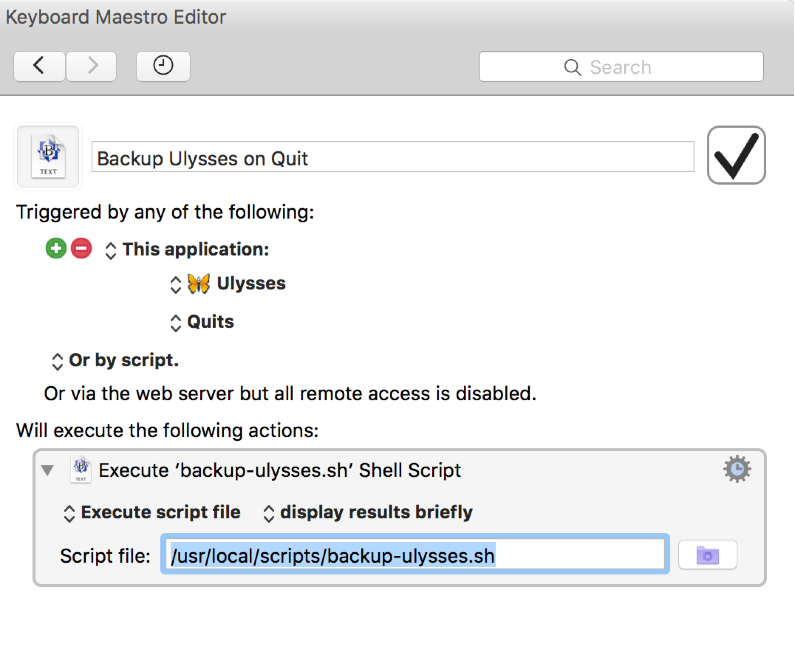

# backup-ulysses

Backup your entire Ulysses preferences folder (which includes your sheets, preferences, etc)

## Simpler Options (added 2016-04-14)

`backup-ulysses-simpler.sh` and `Backup Ulysses on Quit (all in one).kmmacros` have been added to the repo.

`Backup Ulysses on Quit (all in one).kmmacros` is a Keyboard Maestro macro that _already_ has the script `backup-ulysses-simpler.sh` embedded in it.

Assuming you already have Keyboard Maestro installed, all you need to do is double-click on `Backup Ulysses on Quit (all in one).kmmacros` and it will be imported into your Keyboard Maestro setup.

Every time the Ulysses app quits, the script will run, and a backup will be placed in ~/Dropbox/Backups/Ulysses.

If you want it saved to a different location, all you have to do is edit the line

`ARCHIVE_DIR="$HOME/Dropbox/Backups/Ulysses/"`

in the script. 

(`$HOME` refers to your Mac OS X home directory, which is usually something like /Users/JSmith/ or /Users/JohnSmith/)

## Original Option

Will use [dropbox_uploader.sh](https://github.com/andreafabrizi/Dropbox-Uploader/blob/master/dropbox_uploader.sh) if found, but can easily be used without it (see comments in script).

Upon seeing this script, a Ulysses customer support representative stated to me:

> It sounds like the only thing that can harm your texts now is a zombie apocalypse at the 
> Dropbox headquarters or the heat death of the universe.

(Warning: Usual disclaimers apply, use at your own risk, etc etc.)

## How to use

The easiest way to use this is to set up a [Keyboard Maestro](http://www.keyboardmaestro.com/main/) macro which runs every time [Ulysses](http://www.ulyssesapp.com/) quits, like so:

You can download and use 
[my Keyboard Maestro macro](https://raw.githubusercontent.com/tjluoma/backup-ulysses/master/Backup-Ulysses-on-Quit.kmmacros) 
if you wish, just be sure to change `/usr/local/scripts/backup-ulysses.sh` to the appropriate path on your Mac.

 
